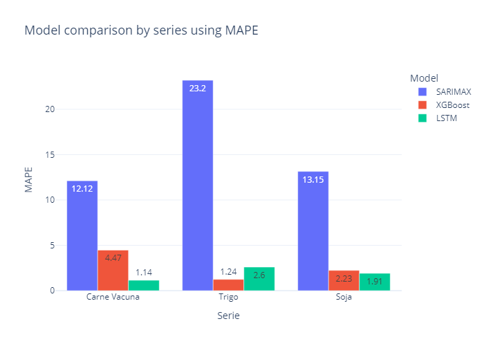

# Commodity Price Forecasting

This project aims to forecast prices of key agricultural commodities — **Carne Vacuna, Soja y Trigo** — using various time series modeling approaches. It compares classical, statistical, machine learning, and deep learning models to determine the most accurate one.

---

## Project Structure

```
project/
│
├── main.ipynb              # Main pipeline: loading, modeling, and final model comparison
├── notebooks/              # Individual notebooks for each model exploration
│   ├── SARIMAX.ipynb
│   ├── XGBoost.ipynb
│   └── LSTM.ipynb
│
├── src/                    # Reusable functions (EDA, loading, models)
│   ├── read_data.py
│   ├── eda.py
│   ├── model_sarimax.py
|   ├── model_lstm.py 
│   └── model_xgboost.py
│ 
├── data/                   # Data files 
│   └── commodities.csv
│
├── models/                   # Final models pipelines .pkl 
│   └── 
│
└── README.md               # This file
```

---

## Data Source

- **Name:** [World Bank Commodity Price Data (The Pink Sheet)](https://www.bcsf.com.ar/ces/base-datos/preview/6/precios-internacionales-de-los-commodities)
- **Coverage:** January 2010 – May 2025
- **Frequency:** Monthly
- **Currency:** Nominal US Dollars (USD)
- **Variables:**

| Product   | Unit                         |
|-----------|------------------------------|
| Soybeans  | USD per Metric Ton           |
| Wheat     | USD per Metric Ton           |
| Beef      | USD per Kilogram             |

---

## Objective

To explore, evaluate, and compare various forecasting approaches:

- Classical models: SARIMAX
- Machine Learning: XGBoost
- Deep Learning: LSTM
- AutoML: AutoTS (in separate notebooks)

---

##  How to Run

1. Clone the repository:

```bash
git clone https://github.com/your_username/forecasting_agro.git
cd forecasting_agro
```

2. Create and activate a virtual environment:

```bash
python -m venv venv
source venv/bin/activate  # On Windows: venv\Scripts\activate
```

3. Install dependencies:

```bash
pip install -r requirements.txt
```

4. Run the main notebook:

```bash
jupyter notebook main.ipynb
```

---

## Methodology

Each model is developed and tested in its respective notebook inside the `notebooks/` folder. There, hyperparameters are tuned, model performance is evaluated, and predictions are visualized.

In `main.ipynb`, results from all models are compiled and compared to choose the best-performing one.

Evaluation metrics:

- RMSE (Root Mean Squared Error)
- MAE (Mean Absolute Error)
- MAPE (Mean Absolute Percentage Error)

---

## Final Comparison

The final model selection is based on error metrics and prediction performance on the test set.


## Conclusions

This analysis explored three distinct modeling approaches — SARIMAX, XGBoost, and LSTM — to forecast the monthly prices of three key agricultural commodities: **Carne Vacuna**, **Trigo**, and **Soja**.

Each model was developed and evaluated based on:

- Feature relevance and preprocessing needs
- Capacity to capture trend and seasonality
- Forecasting accuracy using RMSE, MAE, and MAPE

**SARIMAX** leveraged time series decomposition and exogenous variables to model underlying trends and seasonal patterns.  
**XGBoost** combined manually engineered lag features with tree-based learning, offering flexibility and robustness.  
**LSTM**, a recurrent neural network model, was trained on normalized sequences to capture complex temporal dependencies.

After comparing the performance of all models across the three series, the final results suggest that:

- **XGBoost consistently achieved strong predictive accuracy** while maintaining lower complexity and training time.
- **SARIMAX performed well**, particularly when exogenous variables were present and well-correlated.
- **LSTM models showed potential**, but were more sensitive to data scaling and required careful tuning to avoid overfitting.

> **Final selection**: XGBoost was chosen as the best-performing model overall, balancing accuracy, interpretability, and reproducibility.

This modeling pipeline provides a solid foundation for future extensions such as multistep forecasting, inclusion of external economic indicators, or deployment in real-time prediction environments.
---

## Author

María Sol Pera – [LinkedIn](https://www.linkedin.com/in/m-sol-pera)

This project was developed as part of a broader effort to analyze time series of agricultural commodity prices.
